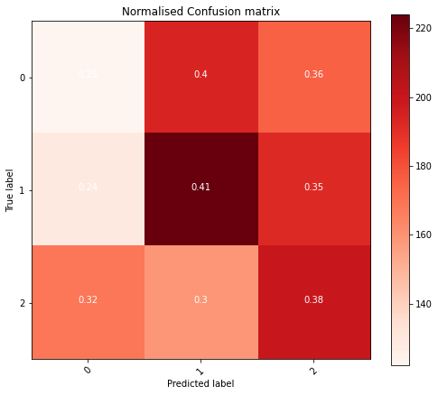
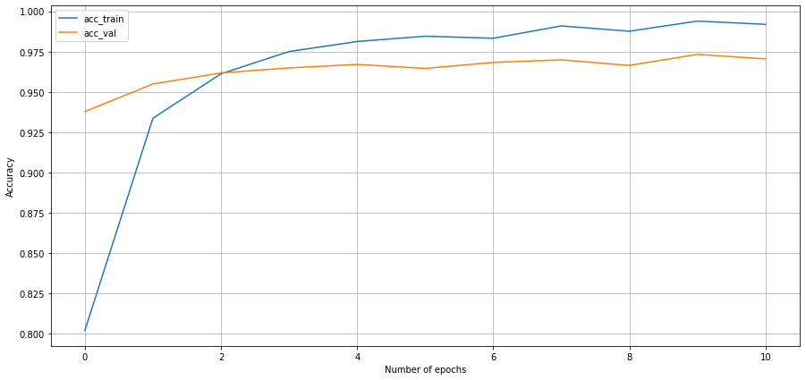
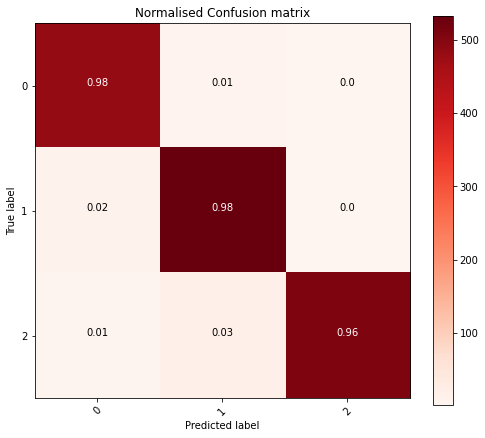
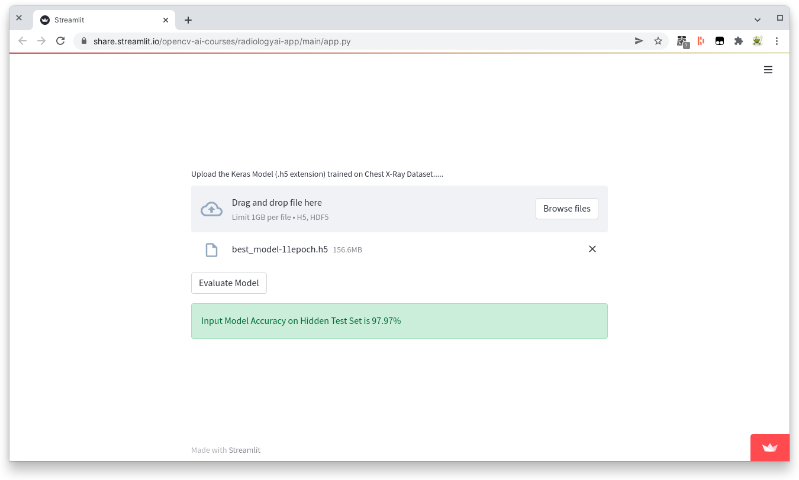

This post is an explanation on how I derived my solution to Project 3: Train and Deploy a Radiology AI from [Computer Vision 2](https://opencv.org/course-computer-vision-two/).

## The Problem

Given a pre-labeled dataset of images train a model that can predict the following with >95% accuracy.

- Normal
- Pneumonia
- COVID19

## Initial changes made to RadiologyAI notebook

The provided notebook required a number of changes before I was able to move to defining a trainable model. The main reason for this was the original notebook was a binary classification problem detecting lungs that were either normal or suffering from pneumonia.

The changes required to also include COVID-19 were:

1. Updating the download URL to use the Dropbox link provided.
2. Updating the `/content/chest_xray` path to `/content/Dataset`
3. Changing the Last Dense layer from 2 units to 3 as the dataset provided is 3 classes (not the original 2)

After these changes the notebook sprung to life returning an unimpressive .3281 val_accuracy.

```python
pretrained_model = tf.keras.applications.c(weights = 'imagenet',
                                                   classes = 1000,
                                                   input_shape = (224, 224, 3),
                                                   include_top = True,
                                                   pooling = 'max')
predictions = Dense(3, activation = 'softmax')(pretrained_model.output)
```

```text
Epoch 1/5
177/177 [==============================] - 149s 821ms/step - loss: 0.6929 - accuracy: 0.3419 - val_loss: 0.6931 - val_accuracy: 0.3263
Epoch 2/5
177/177 [==============================] - 143s 806ms/step - loss: 0.6928 - accuracy: 0.3499 - val_loss: 0.6928 - val_accuracy: 0.3639
Epoch 3/5
177/177 [==============================] - 142s 802ms/step - loss: 0.6928 - accuracy: 0.3400 - val_loss: 0.6929 - val_accuracy: 0.3372
Epoch 4/5
177/177 [==============================] - 142s 800ms/step - loss: 0.6929 - accuracy: 0.3446 - val_loss: 0.6930 - val_accuracy: 0.3166
Epoch 5/5
177/177 [==============================] - 142s 800ms/step - loss: 0.6928 - accuracy: 0.3521 - val_loss: 0.6929 - val_accuracy: 0.3281
```



## Creating a Model

Using transfer learning I then set out to define a new fully connected layer with trainable parameters to get a higher degree of accuracy. The biggest question now is, what should it look like?

I spend many hours trying different models, from those included in the course to suggestions from many papers. In the end I discovered a paper by the University of Valladolid[^1] which had a clear suggestion. It was relatively small and simple and I thought it should be repeatable.

Taking what I understood from the paper I ended up with the python code below.

```python
pretrained_model = tf.keras.applications.EfficientNetB4(include_top = False, 
                                                   weights = 'imagenet', 
                                                   input_shape = (224, 224, 3), 
                                                   pooling = 'max')

for layer in pretrained_model.layers:
  layer.trainable = False

model = models.Sequential()
model.add(pretrained_model)
model.add(layers.Dense(128, activation = 'relu'))
model.add(layers.Dropout(0.3))
model.add(layers.Dense(64, activation = 'relu'))
model.add(layers.Dropout(0.3))
model.add(layers.Dense(32, activation = 'relu'))
model.add(layers.Dropout(0.3))
model.add(layers.Dense(3, activation = 'softmax'))

# Change from SGD optimizer to Adam with learning rate of .0001
model.compile(optimizer = tf.keras.optimizers.Adam(0.0001),
              loss = "binary_crossentropy",
              metrics = ["accuracy"])

history = model.fit(train_datagen,
                    epochs = 11,
                    steps_per_epoch = (len(train_datagen)),
                    validation_data = val_datagen,
                    validation_steps = (len(val_datagen)),
                    shuffle = False,
                    callbacks = callback)
```

As the course mentioned that leaning on prior work was a good starting point I was feeling rather confident until the epochs started rolling by.

```text
Epoch 1/11
177/177 [==============================] - 197s 951ms/step - loss: 0.7495 - accuracy: 0.3286 - val_loss: 0.6480 - val_accuracy: 0.3518 - lr: 1.0000e-04
Epoch 2/11
177/177 [==============================] - 161s 909ms/step - loss: 0.6584 - accuracy: 0.3327 - val_loss: 0.6482 - val_accuracy: 0.3204 - lr: 1.0000e-04
Epoch 3/11
177/177 [==============================] - 160s 905ms/step - loss: 0.6551 - accuracy: 0.3315 - val_loss: 0.6399 - val_accuracy: 0.3278 - lr: 1.0000e-04
```

## Better Accuracy

I spent a lot of time scratching my head wondering what I was doing wrong until two things hit me.

1. Lungs are not symmetrical, I shouldn't be flipping them!
2. The pre-trained images were trained on object classification problems maybe I need to fine tune it.

### Symmetry of the Human Body

This came to me when I was pondering what options I had left to increase accuracy.

I remembered that the left lung had less space, that would be different. In search for confirmation I found a page on AppliedRadiology.com[^2] showing some challenges of different parts of the body including the chest.

> Because the heart lies asymmetrically to the left in the thorax, determining right from left in the thorax is not a problem except in the rare case of situs inversus.

To solve this was quite easy and was something I overlooked when first looking at the notebook thinking, "lungs are symmetrical that should be ok."

```python
train_val_gen = ImageDataGenerator(zca_epsilon = 0.0,
                                   horizontal_flip = False,
                                   rescale = 1./255)        # Do not change rescale
```

With this change alone the accuracy didn't really change suggesting something else was needed.

```text
Epoch 1/11
177/177 [==============================] - 171s 880ms/step - loss: 2.8510 - accuracy: 0.3282 - val_loss: 1.8354 - val_accuracy: 0.3278
Epoch 2/11
177/177 [==============================] - 151s 851ms/step - loss: 2.6794 - accuracy: 0.3307 - val_loss: 1.6513 - val_accuracy: 0.3278
Epoch 3/11
177/177 [==============================] - 151s 850ms/step - loss: 2.5755 - accuracy: 0.3326 - val_loss: 1.4867 - val_accuracy: 0.3278
```

In hindsight this ended up being a distraction but did result in a slightly higher accuracy.

### Fine Tuning

When first reading though the problem I thought that I could solve it purely with transfer learning. Reading more and revisiting the course material I concluded the next logical step would be to retrain all or part of the convolutional layers.

The University of Valladolid[^1] paper that I had based my model on up until now retrained the EfficientNetB4 layers but when I tried to do the same by removing the following lines a `ResourceExhaustedError` occurred in Google Colab:

```python
for layer in pretrained_model.layers:
  layer.trainable = False
```

Given the paper had high accuracies listed for other models I ended up landing on using the VGG19 model and retraining the last convolutional network using:

```python
for layer in pretrained_model.layers:
  if layer.name == 'block5_conv1':
    break
  layer.trainable = False
```

The result!

```text
Epoch 1/11
177/177 [==============================] - 174s 973ms/step - loss: 0.3729 - accuracy: 0.7653 - val_loss: 0.1565 - val_accuracy: 0.9244
Epoch 2/11
177/177 [==============================] - 170s 962ms/step - loss: 0.1783 - accuracy: 0.9201 - val_loss: 0.1382 - val_accuracy: 0.9397
Epoch 3/11
177/177 [==============================] - 170s 960ms/step - loss: 0.1188 - accuracy: 0.9500 - val_loss: 0.1329 - val_accuracy: 0.9453
Epoch 4/11
177/177 [==============================] - 170s 962ms/step - loss: 0.0995 - accuracy: 0.9583 - val_loss: 0.1941 - val_accuracy: 0.9272
Epoch 5/11
177/177 [==============================] - 171s 967ms/step - loss: 0.0776 - accuracy: 0.9671 - val_loss: 0.1278 - val_accuracy: 0.9614
Epoch 6/11
177/177 [==============================] - 170s 958ms/step - loss: 0.0666 - accuracy: 0.9742 - val_loss: 0.1332 - val_accuracy: 0.9574
Epoch 7/11
177/177 [==============================] - 170s 959ms/step - loss: 0.0499 - accuracy: 0.9801 - val_loss: 0.1439 - val_accuracy: 0.9639
Epoch 8/11
177/177 [==============================] - 169s 956ms/step - loss: 0.0503 - accuracy: 0.9808 - val_loss: 0.1415 - val_accuracy: 0.9577
Epoch 9/11
177/177 [==============================] - 170s 958ms/step - loss: 0.0415 - accuracy: 0.9826 - val_loss: 0.1433 - val_accuracy: 0.9636
Epoch 10/11
177/177 [==============================] - 170s 962ms/step - loss: 0.0316 - accuracy: 0.9882 - val_loss: 0.1496 - val_accuracy: 0.9661
Epoch 11/11
177/177 [==============================] - 170s 960ms/step - loss: 0.0268 - accuracy: 0.9903 - val_loss: 0.1776 - val_accuracy: 0.9670
```


A massive improvement! Giving me the confidence I was on the right track. Now to consolidate all that I had learnt.

## Final Solution

In the end I settled on the following model parameters which produced a pretty good result.

- Using the VGG19 pretrained model
- Training the last convolutional
- Setting `horizontal_flip` to `False`
- 3 dense layers with relu activation
- Adam optimizer
- 11 epochs (possibly fewer would've been enough)





## Conclusion

I was a little concerned using 11 epochs that I was getting in the realm of overfitting to the training data however there were some benefits and val_accuracy was still declining. I suspect with some more experience training models I may be able to tune things a bit more but my biggest learnings from this project was:

- The largest accuracy happen in the early epochs, if things look bad, stop and reevaluate. There is no need to run until the end.
- Another pre-trained model might have performed better could've run multiple to see, decided not to invest more time

The next step would be to take my model and compare it with other pretrained models but I decided that it was time to put this problem asside and test the accuracy using the external dataset provided.



**\>97% Alright!**

## References

[^1]: [Automated medical diagnosis of COVID-19 through EfficientNet convolutional neural network](https://www.ncbi.nlm.nih.gov/pmc/articles/PMC7836808/) - Gonçalo Marques,⁎ Deevyankar Agarwal, and Isabel de la Torre Díez

[^2]: [Knowing right from left on X-rays: A way to minimize errors of laterality](https://appliedradiology.com/articles/knowing-right-from-left-on-x-rays-a-way-to-minimize-errors-of-laterality) - Carl E. Fabian, MD, FACR
