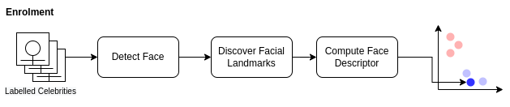
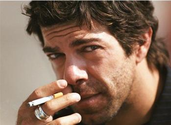
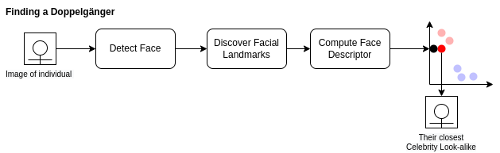
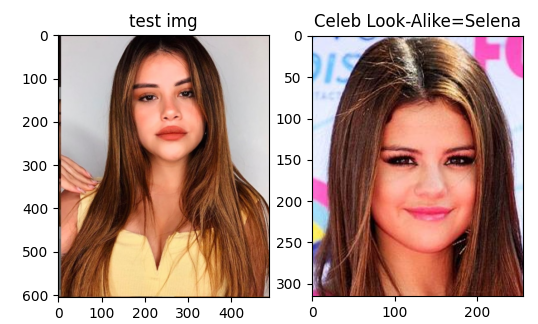
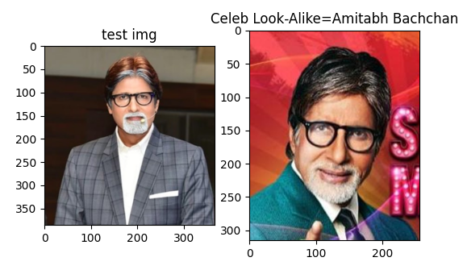
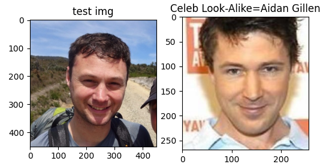

This post explains my approach to solving the [Computer Vision 2](https://opencv.org/course-computer-vision-two/) Find Celebrity Look-Alike project.

> Your Task
> 
> In this project, we will build a Fun Application - We will use the Face Embeddings to find a doppelganger or look-alike to a given person. Specifically, we will give you images of two persons and a celebrity dataset. Your task will be to find their celebrity look-alike.
>
> -- Computer Vision 2 / Project 2: DoppelGanger - Find Celebrity Look-Alike



## Getting Started

As part of the course material, some of the traditional face recognition caught my eye. Specifically the [Eigen Faces video from LearnOpenCV](https://learnopencv.com/eigenface-using-opencv-c-python/).

I considered using Fisherfaces first but quickly realised that the approach of all of the methods was to take a face and project into a high-dimensional space. Facial detection is performed by detecting the distance (Euclidean distance) between known faces to determine the closest match. To detect a doppelganger my thinking is that I will need to ignore or greatly increase the threshold to get looser matches.

With this in mind, I concluded that the best approach would be to use the most accurate model to generate a metric from an image. The obvious choice is the [dlib pre-trained deep learning model](http://blog.dlib.net/2017/02/high-quality-face-recognition-with-deep.html).

As part of the course, a subset of the [Celebrity Together](https://www.robots.ox.ac.uk/~vgg/data/celebrity_together/) was provided making the enrolment step a bit easier. There was one minor issue which I'll go into detail about later.

## Enrolment

With a model able to turn any image into 128-dimensional vector we can build up a list of labelled vectors from the pre labelled Celebrity Together images.



The image above shows the process we must go through for each image to convert them from a jpeg to a face descriptor using dlib. I have used a 2d plot of 2 colours to indicate 2 different celebrities. In theory, as we process each image, photos of the same celebrity should be "closer" together.

The process we use for each image:

  1. Convert the image to RGB, the format required for dlib
  2. Detect Faces in the image
  3. Discover the facial landmarks
  4. Compute face descriptor
  5. Store face descriptor/label

### Step 1: Open and convert image

Both [opening of the file](https://docs.opencv.org/3.4/d4/da8/group__imgcodecs.html#ga288b8b3da0892bd651fce07b3bbd3a56) and [converting the colour](https://docs.opencv.org/3.4/d8/d01/group__imgproc__color__conversions.html#ga397ae87e1288a81d2363b61574eb8cab) are simple functions within OpenCV so not a lot to add here other than maybe I should have added a check that the file opened successfully.

```python
def enrol(imgPath, label):
    global faceDescriptors, index
    
    img = cv2.imread(imgPath)
    img = cv2.cvtColor(img, cv2.COLOR_BGR2RGB)
```

### Step 2: detecting faces

In this step, I hit a bit of a bump in the road. I made the wrong assumption that all of the images were clean and contained exactly one and only one face. The `faceDetector = dlib.get_frontal_face_detector()` returns an array but originally I simply assumed that I could use `faces[0]` and I'd be good.

Didn't take long for my code to blow up and realise that there are cases where the number of faces detected was not equal to 1 so I updated my code to:

```python
    faces = faceDetector(img)
    if len(faces) != 1:
        print("{} Faces found in {}. Skipping".format(len(faces), imgPath))
        return
```

After adding this I found a number of cases in the dataset provided were wasn't a single face. eg.
```
0 Face(s) found in ../resource/asnlib/publicdata/celeb_mini/n00002000/n00002000_00000809.JPEG. Skipping
2 Face(s) found in ../resource/asnlib/publicdata/celeb_mini/n00002394/n00002394_00000221.JPEG. Skipping
```

Why?



In the first image, the face is obscured with a hand.

In the second image, I realised that the data set came from "Celebrity Together" suggesting that there could be more than one person in an image.

I considered diving in more to extract the correct face as per the label or even using the full dataset from its source but concluded that the mission here was to find a doppelganger and made the call that I'd exclude these images.

### Step 3: Discover Facial Landmarks

Using dlib to discover the facial landmarks is relatively simple `shapePredictor = dlib.shape_predictor(PREDICTOR_PATH)`

```python
    # Find facial landmarks for each detected face
    shape = shapePredictor(img, faces[0])
```

### Step 4: Compute face descriptor

Again dlib is used to compute the face descriptor `faceRecognizer = dlib.face_recognition_model_v1(FACE_RECOGNITION_MODEL_PATH)`.

```python
    faceDescriptor = faceRecognizer.compute_face_descriptor(img, shape)
```

To make it easier for us later to calculate distances, we need to convert the 128-dimensional vector into a NumPy array using the code below.

```python
    # Convert face descriptor from Dlib's format to list, then a NumPy array
    faceDescriptorList = [x for x in faceDescriptor]
    faceDescriptorNdarray = np.asarray(faceDescriptorList, dtype=np.float64)
    faceDescriptorNdarray = faceDescriptorNdarray[np.newaxis, :]
    return faceDescriptorNdarray
```

### Step 5: Store face descriptor / label

The final stage is to add the image as a row in the faceDescriptors matrix.

```python
    if faceDescriptors is None:
        faceDescriptors = faceDescriptor
    else:
        faceDescriptors = np.concatenate((faceDescriptors, faceDescriptor), axis=0)
```

And to store the label and other useful details for that vector/image for retrieval later.

```python
    index.append({
        "name": labelMap[label], 
        "label": label,
        "image": imgPath,
    })
```

## Saving Time

I added the following lines after enrolling all of the images so that I had a snapshot of the `faceDescriptors` and `index` allowing me to walk away and come back later without having to run an enrolment first.

```python
np.save('descriptors.npy', faceDescriptors)
with open('index.pkl', 'wb') as f:
    cPickle.dump(index, f)
```

And to read it back into variables

```python
    index = np.load('index.pkl', allow_pickle=True)
    faceDescriptorsEnrolled = np.load('descriptors.npy')
```

## Finding a Doppelganger



Finding a doppelganger is almost the exact same process as enrolment. Steps 1 - 4 are identical. 

```python
    im = cv2.imread(test)
    imDlib = cv2.cvtColor(im, cv2.COLOR_BGR2RGB)
    
    
    faces = faceDetector(cv2.cvtColor(im, cv2.COLOR_BGR2RGB))
    faceDescriptor = calcFaceDescriptor(im, faces[0])
```

Now we've calculated the descriptor for the face in the image whom we'd like to find their celebrity look alike we need to find the closest match in our celebrity `faceDescriptors`.

```python
    # Calculate Euclidean distances between face descriptor calculated on face dectected
    # in current frame with all the face descriptors we calculated while enrolling faces
    distances = np.linalg.norm(faceDescriptorsEnrolled - faceDescriptor, axis=1)
    # Calculate minimum distance and index of this face
    argmin = np.argmin(distances)  # index
```

Using the index of the row we can now pull back the Celebrity name and the image that we determined as their look alike.

```python
    celeb_name = index[argmin]["name"]
    celeb_img  = cv2.imread(index[argmin]["image"])
```

## The results

Running using the test images \*\*drumroll**

Sofia Solares looks like



Shashikant Pedwal looks like



And I apparently look like



## Improvements

While working on this project I considered the following but considered them unnecessary.

### Use a Threshold

A `THRESHOLD` could be introduced to minimise bad matches. I decided instead to always return the closest enrolled celebrity which in the images I tried was adequate.

```python
    minDistance = distances[argmin]
    if minDistance <= THRESHOLD:
        label = index[argmin]
    else:
        label = 'unknown'
```

### Enrol More Celebrities

The mini dataset contained 1,166 celebrities however Celebrity Together boasts that it contains 2,622 which may give better matches for some individuals but I was happy enough with the results from the mini set.
